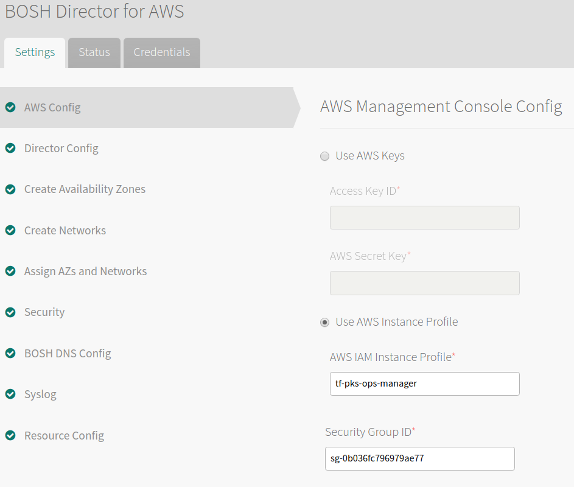
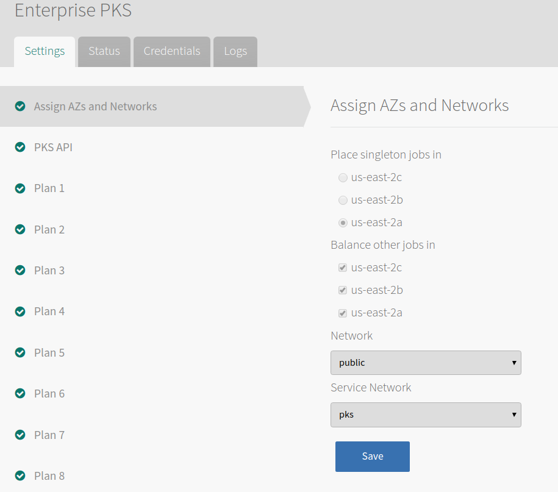
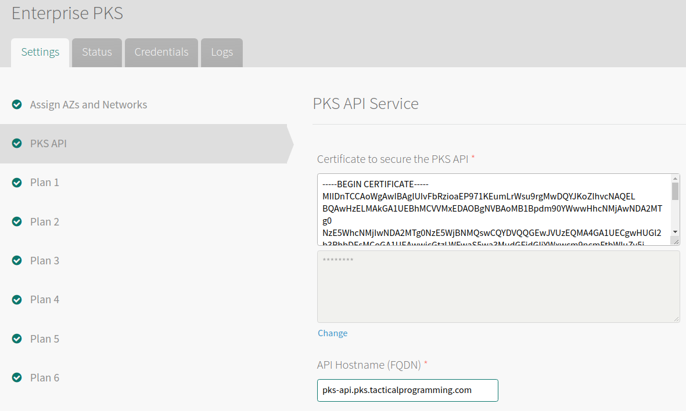
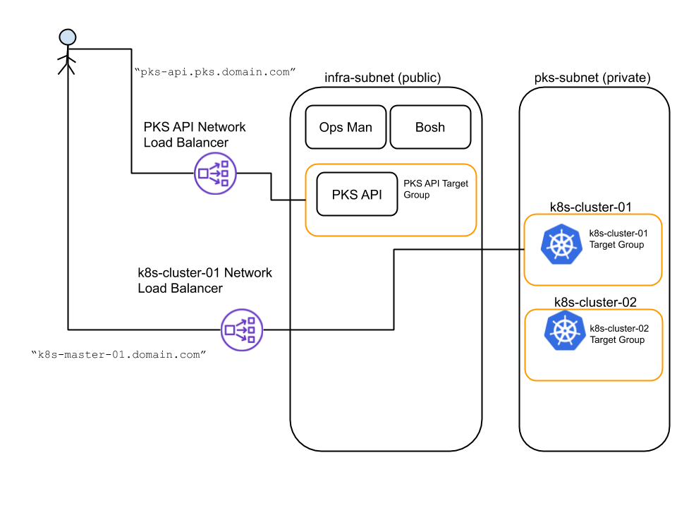
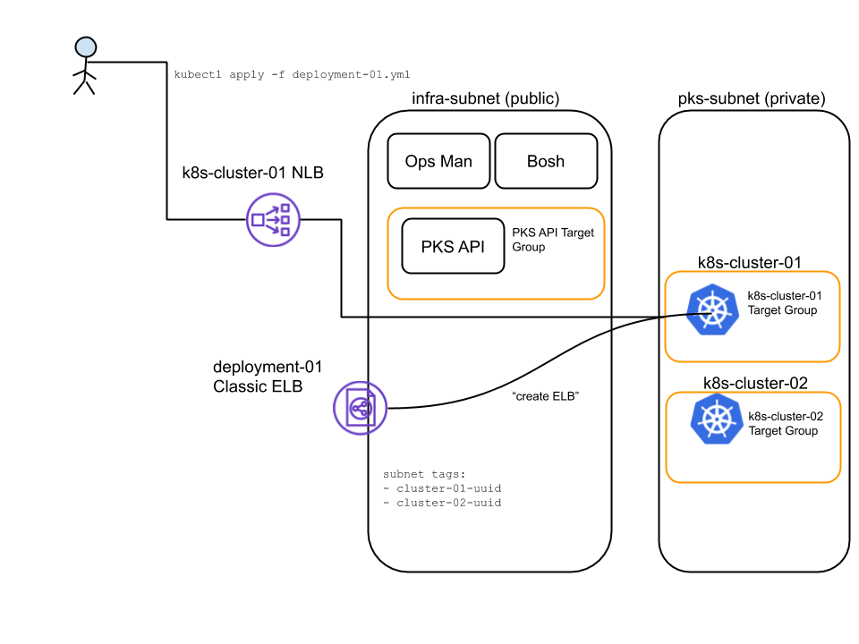

# Deployment Guide
This guide is meant to be exactly that - a guide. We cannot help you through each deployment detail and we assume a
level of experience/proficiency on the reader's part. For example, we assume you have experience, and basic
understanding of, using the Ops Manager web UI and the CLI. Our intention with this document is not a step-by-step
install manual, but rather a collection of common tasks, typical pitfalls, and how to overcome them.

# Requirements
* The `om` cli
* Terraform `0.12` or later
* An AWS access/secret keypair (but you knew that already)
* A system domain.  Since this deployment will be in AWS, we highly recommend making a subdomain and controlling that subdomain via Route 53. This document will assume the domain `pks.domain.com`.
* A server certificate for the PKS API server. If you're using a development installation, using the self-signed option in Ops Manager is fine.

## Pave IaaS and install Ops Manager
Copy `terraform.tfvars.example` to your own `terraform.tfvars` and fill in the values. 
Fill out the `provider.yml` file with your AWS credentials. 

Init, plan, and run.

```shell script
terraform init
terraform plan -o out plan
terraform apply plan
```

The result of a successful run should result in a new VPC with all networking scaffolding, plus an Ops Manager VM deployed.

## Update DNS for Ops Manager
Ops Manager records the ip or DNS name used to navigate to it for the first time. Save yourself some pain and create an A record for your new Ops Manager vm.

## Configure and Deploy the Bosh Director


_IAM_

You will use an AWS IAM instance profile. Terraform created this for you. Be sure to use the _instance profile_ and not the policy, else your Bosh deploy will fail.

_Security Groups_

The "Security Group ID" field is the security group that will go in front of the Bosh Director. This is also the security group that will go in front of the following types of VMs:
- PKS API server
- Workload k8s masters
- Workload k8s workers

This limitation is a known issue and the workaround is to be sure the one security group has all necessary ports (Terraform should have done this for you).

One exception to the above behavior is that you _can_ change the security group for the PKS API server (but not workload clusters). To do this, you need to use a VM Extension. Read the next section if interested.

_VM Extension for PKS API server_

In order to change the security group for the PKS API server, download the Bosh director config with the `om` cli and add the following:

```yaml
vmextensions-configuration:
- name: pks-api-lb-security-groups
  cloud_properties:
    security_groups:
    - tf-pks-pks-api-lb-sg
    - tf-pks-platform-vms-sg
```
Where:
* `pks-api-lb-security-groups` can be any descriptive name. You will use it later when configuring PKS.
* `tf-pks-pks-api-lb-sg` and `tf-pks-platform-vms-sg` are the names of the security groups you wish to use. Be sure these entries reflect what is in _your_ environment.

Following is a diff of before/after making these additions:
```text
--- director-config.yml.orig	
+++ director-config.yml	
@@ -126,6 +126,9 @@
     persistent_disk:
       size_mb: automatic
     swap_as_percent_of_memory_size: automatic
-vmextensions-configuration: []
+vmextensions-configuration:
+  - name: pks-api-lb-security-groups
+    cloud_properties:
+      security_groups: 
+      - tf-pks-pks-api-lb-sg
+      - tf-pks-platform-vms-sg
 vmtypes-configuration: {}
```
Once modified, upload the configuration to Ops Manager and deploy the Bosh Director.


## Configure and Deploy PKS
_Networks_



The "Network" field is the Bosh network that will hold your PKS API server. This should be a public subnet.

The "Service Network" field is the Bosh network that will hold workload Kubernetes clusters. This should be a private subnet.

If you used Terraform, these networks have already been made for you.

_PKS API_



This config holds the cert that the PKS API server will use to identify itself. As such, you need to provide a cert that will contain the correct FQDN. If you have a development deployment, have Ops Manager create a cert for you. For this document, we will use `pks-api.pks.domain.com`.

The name in the cert *MUST* match the value you put in the "API Hostname (FQDN)" field.

_Plans_

Adjust the Plans as necessary. Be aware that even the smallest plan, "Plan 1", creates three worker nodes. You may want to adjust this down to 1 for canary or simple deployments.

_Errands_

Be sure the errand named "Upgrade all clusters errand" is set to False. Leaving this set to True will consume time and leave us prone to accidental upgrades in the future.

_VM Extensions_

If you created a VM Extension for security groups during the Bosh Director config, you need to add that VM Extension to the PKS config. The process is the same: download, modify, upload.

Following is a diff for before/after adding the security groups:
```text
--- pks-.yml.orig
+++ pks-.yml	
@@ -215,6 +215,8 @@
     persistent_disk:
       size_mb: automatic
     swap_as_percent_of_memory_size: automatic
+    additional_vm_extensions:
+    - pks-api-lb-security-groups
 errand-config:
   delete-all-clusters:
     pre-delete-state: true
```

Where `pks-api-lb-security-groups` is the descriptive name you used when creating the VM Extension in the Bosh Config.

If you struggle to understand how we're using VM Extension, think of it this way: During the Bosh Director config, we _defined_ the VM Extensions we want to be made available to all Bosh deployments. During the PKS config, we're _using_ that VM Extension. This is why the names must match.

Deploy PKS.

## Make the PKS API Server Available

As a reminder, here is what our deployed architecture looks like.



The PKS API server needs to be in the Target Group associated with the Network Load Balancer (NLB) created for it. You must do two things:
* Place the PKS API server in the Target Group
* Configure a CNAME that matches the cert's name (in our example, `pks-api.pks.domain.com`), pointing to the FQDN for the NLB. This step is not optional. Forgoing this step will cause, among other things, a `pks login` to fail.

## Deploy A Workload Kubernetes Cluster

Using the `pks` cli:
```text
pks create-cluster dev-01 --external-hostname dev-cluster-01.pks.domain.com --plan=small
```

The build can take upwards of 20 minutes, depending on IaaS speed. To view the status of the cluster, use the `pks` cli:
```shell text
pks cluster dev-01
```

## Make the Workload Kubernetes Cluster Available

Your workload k8s cluster is in a private subnet but needs to be made available. Do the following:
* Create a new NLB
* Create a listener in this NLB for port 8443
* Create a new target group (of type 'instance') and put the k8s master(s) in this target group.
* (Optional) Create a new CNAME, pointing to the FQDN of the NLB. This cname should match the value you gave for `--external-hostname` in your `pks create-cluster` command.

If you're using Terraform, the [Load Balancers](../lbs.tf) file has examples on doing this one cluster at a time, or all PKS-managed clusters.

Note: You will need to create an NLB, listener, and Target Group for _each_ workload k8s cluster. Automation is highly recommended. Again, see the [Load Balancers](../lbs.tf) file for examples.


## Connect to Your Workload Kubernetes Cluster

Using the `pks` cli:
```text
pks get-credentials dev-01
```

This command will configure your kubectl context to connect to your k8s cluster.


## Deploying A Workload and Exposing It

Feel free to deploy any workload you are familiar with to your new k8s cluster. If you need some help, feel free to use the [hello-kubernetes](../sample-workloads/hello-k8s.yml) deployment file.

In order to have Kubernetes create an ELB on your behalf, k8s needs to know where the ELBs will terminate. For us, this will be the public subnets created. We tell Kubernetes to use these subnets by adding tags to the public subnets. 

The [Load Balancers](../lbs.tf) file and [Subnets](../subnets.tf) file together have an example on how to have Terraform do _all_ of this for you. For the manual version, see [the official docs](https://docs.pivotal.io/pks/1-5/deploy-workloads.html#aws) or continue reading.

Use the PKS cli to fetch the UUID of your cluster:
```shell script
pks cluster dev-01
```

The output will contain a `Cluster UUID`. Record this.

In the AWS Console, create a new tag _on each public subnet_ as follows:
```text
Key: kubernetes.io/cluster/service-instance_CLUSTER-UUID
Value: <empty>
```

Now when you expose a deployment by creating a k8s service of type LoadBalancer, Kubernetes will create an ELB on your behalf and direct traffic to your pod(s).

The diagram below illustrates this action.



This concludes the deployment guideline.
